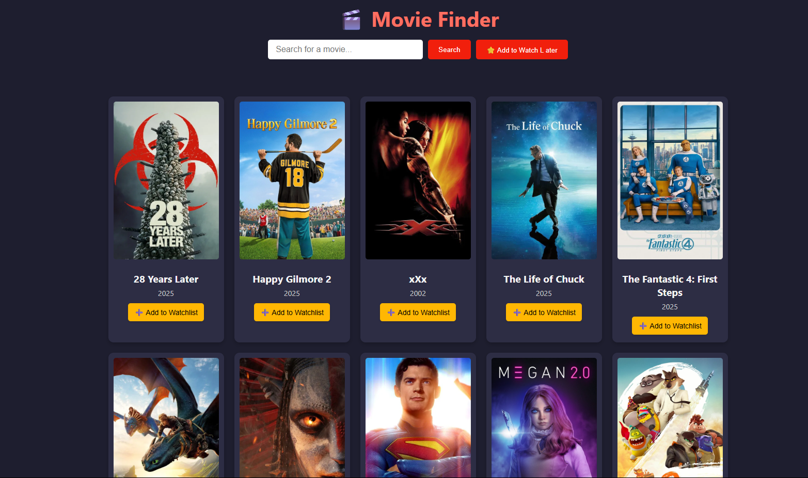
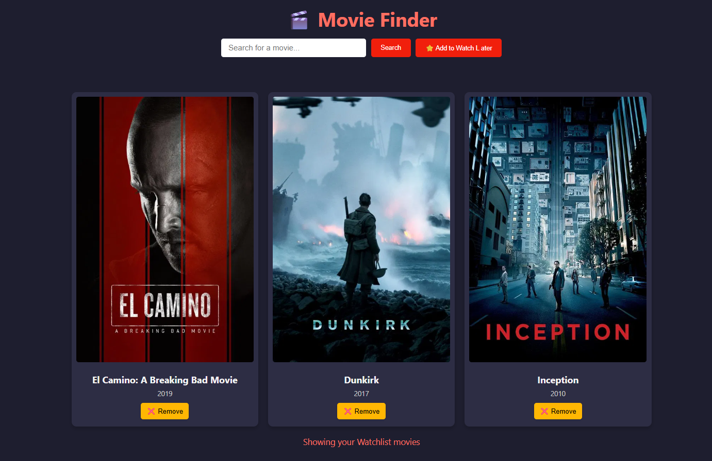
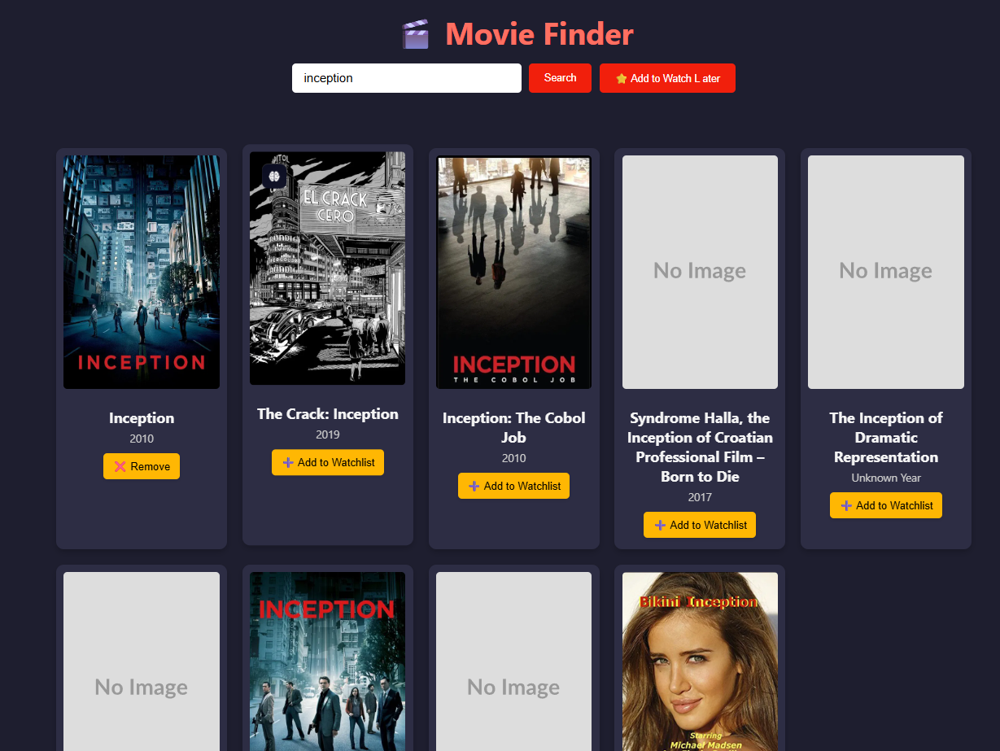

# Movie Finder App

Movie Finder App is a modern, responsive web application that allows users to search for movies, view trending titles, and manage a personal watchlist. The app leverages [The Movie Database (TMDb) API](https://www.themoviedb.org/documentation/api) to provide up-to-date movie information, including posters, release dates, ratings, overviews, genres, and trailers.

## Features

- **Movie Search:** Instantly search for movies by title using TMDb's powerful search API.
- **Trending Movies:** Discover the most popular movies trending today.
- **Movie Details:** View detailed information about each movie, including a poster, release date, IMDB rating, overview, genres, and a link to the official trailer (when available).
- **Watchlist:** Add or remove movies from your personal watchlist, which is saved in your browser's local storage for persistent access.
- **Responsive Design:** Enjoy a seamless experience on desktop, tablet, and mobile devices.
- **User-Friendly Interface:** Clean, modern UI with intuitive controls and helpful feedback messages.

## Demo
Screenshot of trending page


Screenshot of movies being saved in Watchlater list 


Screenshot of movies getting fetched when searched 



## Getting Started

### Prerequisites

- A modern web browser (Chrome, Firefox, Edge, Safari, etc.)
- A TMDb API key (free to obtain from [TMDb API](https://www.themoviedb.org/documentation/api))

### Installation

1. **Clone or Download the Repository**

   ```
   git clone https://github.com/yourusername/movie-finder-app.git
   cd movie-finder-app
   ```

2. **Obtain a TMDb API Key**

   - Sign up at [TMDb](https://www.themoviedb.org/) and request an API key.

3. **Configure the API Key**

   - Open [`script.js`](script.js).
   - Replace the placeholder string in the following line with your actual TMDb API key:

     ```js
     const api_key = "YOUR_TMDB_API_KEY";
     ```

4. **Run the App**

   - Simply open [`index.html`](index.html) in your web browser.

## Project Structure

```
index.html        # Main HTML file
style.css         # App styling (responsive, modern design)
script.js         # All JavaScript logic (API calls, UI updates, watchlist)
README.md         # Project documentation
```

## Usage

- **Search for Movies:** Enter a movie title in the search box and click "Search" or press Enter.
- **View Trending:** On page load, trending movies are displayed automatically.
- **Movie Details:** Click on any movie card to view more details and watch the trailer.
- **Add to Watchlist:** Click "➕ Add to Watchlist" to save a movie. To remove, click "❌ Remove".
- **View Watchlist:** Click the "⭐ Add to Watch Later" button to see your saved movies.

## Technologies Used

- **HTML5** & **CSS3**: Semantic markup and responsive, modern styling.
- **JavaScript (ES6+)**: DOM manipulation, API integration, and local storage.
- **TMDb API**: Movie data, images, and trailers.

## Customization

- **Styling:** Modify [`style.css`](style.css) to change the look and feel.
- **Functionality:** Extend [`script.js`](script.js) to add features like genre filtering, pagination, or user authentication.

## Known Issues & Limitations

- The app requires a valid TMDb API key to function.
- Watchlist is stored in browser local storage and is not synced across devices.
- Some movies may not have trailers or complete metadata.

## Contributing

Contributions are welcome! Please open an issue or submit a pull request for bug fixes, improvements, or new features.

## License

This project is licensed under the [MIT License](LICENSE).

## Acknowledgements

- [The Movie Database (TMDb)](https://www.themoviedb.org/) for their comprehensive API.
- [Font Awesome](https://fontawesome.com/) for icons (if used).
- Inspiration from the open-source community.

---

**Enjoy discovering movies with Movie